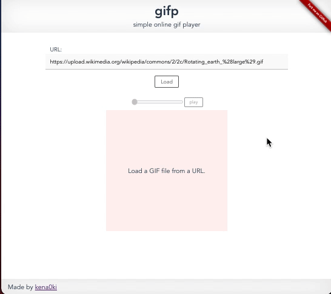

# gifp

This is a source code repository for the website gifp, which provides an online gif player.  
You can play an animated GIF that is on the Internet as seen below.  

### Note:
The website is not running only on the client-side but uses a proxy server to avoid CORS policy, which restricts manipulating cross-domain images.  
The proxy server configuration file is not in this repository, but its job is just overwriting HTTP headers of responses.